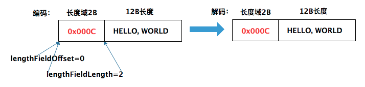
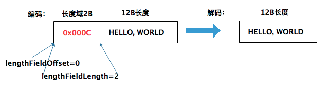
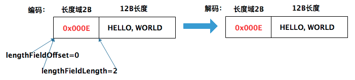
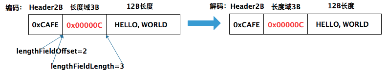

## 一、LengthFieldBasedFrameDecoder - 参数说明

**1. LengthFieldBasedFrameDecoder作用**
LengthFieldBasedFrameDecoder解码器自定义长度解决TCP粘包黏包问题。所以LengthFieldBasedFrameDecoder又称为: 自定义长度解码器

**1.1 TCP粘包和黏包现象**

1. TCP粘包是指发送方发送的若干个数据包到接收方时粘成一个包。从接收缓冲区来看，后一个包数据的头紧接着前一个数据的尾。

2. 当TCP连接建立后，Client发送多个报文给Server，TCP协议保证数据可靠性，但无法保证Client发了n个包，服务端也按照n个包接收。Client端发送n个数据包，Server端可能收到n-1或n+1个包。

**1.2 为什么出现粘包现象**

1. 发送方原因: TCP默认会使用Nagle算法。而Nagle算法主要做两件事：1）只有上一个分组得到确认，才会发送下一个分组；2）收集多个小分组，在一个确认到来时一起发送。所以，正是Nagle算法造成了发送方有可能造成粘包现象。

2. 接收方原因: TCP接收方采用缓存方式读取数据包，一次性读取多个缓存中的数据包。自然出现前一个数据包的尾和后一个收据包的头粘到一起。

**1.3 如何解决粘包现象**

1. 添加特殊符号，接收方通过这个特殊符号将接收到的数据包拆分开 - DelimiterBasedFrameDecoder特殊分隔符解码器

2. 每次发送固定长度的数据包 - FixedLengthFrameDecoder定长编码器

3. 在消息头中定义长度字段，来标识消息的总长度 - LengthFieldBasedFrameDecoder自定义长度解码器

**2. LengthFieldBasedFrameDecoder怎么使用**

1. LengthFieldBasedFrameDecoder本质上是ChannelHandler，一个处理入站事件的ChannelHandler

2. LengthFieldBasedFrameDecoder需要加入ChannelPipeline中，且位于链的头部

**3. LengthFieldBasedFrameDecoder - 6个参数解释**
LengthFieldBasedFrameDecoder是自定义长度解码器，所以构造函数中6个参数，基本都围绕那个定义长度域，进行的描述。

1. maxFrameLength - 发送的数据帧最大长度

2. lengthFieldOffset - 定义长度域位于发送的字节数组中的下标。换句话说：发送的字节数组中下标为${lengthFieldOffset}的地方是长度域的开始地方

3. lengthFieldLength - 用于描述定义的长度域的长度。换句话说：发送字节数组bytes时, 字节数组bytes[lengthFieldOffset, lengthFieldOffset+lengthFieldLength]域对应于的定义长度域部分

4. lengthAdjustment - 满足公式: 发送的字节数组bytes.length - lengthFieldLength = bytes[lengthFieldOffset, lengthFieldOffset+lengthFieldLength] + lengthFieldOffset + lengthAdjustment 

5. initialBytesToStrip - 接收到的发送数据包，去除前initialBytesToStrip位

6. failFast - true: 读取到长度域超过maxFrameLength，就抛出一个 TooLongFrameException。false: 只有真正读取完长度域的值表示的字节之后，才会抛出 TooLongFrameException，默认情况下设置为true，建议不要修改，否则可能会造成内存溢出

7. ByteOrder - 数据存储采用大端模式或小端模式

#### **划重点: 参照一个公式写，肯定没问题:**

#### 公式: 发送数据包长度 = 长度域的值 + lengthFieldOffset + lengthFieldLength + lengthAdjustment

## 二、实际例子

### 举例解释参数如何写

客户端多次发送"HELLO, WORLD"字符串给服务端。"HELLO, WORLD"共12字节(12B)。长度域中的内容是16进制的值，如下:

0x000c -----> 12；0x000e -----> 14

#### 1、场景1

数据包大小: 14B = 长度域2B + "HELLO, WORLD"

解释:

如上图，长度域的值为12B(0x000c)。希望解码后保持一样，根据上面的公式,参数应该为：

1. lengthFieldOffset = 0

2. lengthFieldLength = 2

3. lengthAdjustment = 0 = 数据包长度(14) - lengthFieldOffset - lengthFieldLength - 长度域的值(12)

4. initialBytesToStrip = 0 - 解码过程中，没有丢弃任何数据

#### 2、场景2

数据包大小: 14B = 长度域2B + "HELLO, WORLD"

解释:

上图中，解码后，希望丢弃长度域2B字段，所以，只要initialBytesToStrip = 2即可。其他与场景1相同

1. lengthFieldOffset = 0

2. lengthFieldLength = 2

3. lengthAdjustment = 0 = 数据包长度(14) - lengthFieldOffset - lengthFieldLength - 长度域的值(12) 

4. initialBytesToStrip = 2 解码过程中，没有丢弃2个字节的数据

#### 3、 场景3

数据包大小: 14B = 长度域2B + "HELLO, WORLD"。与场景1不同的是:场景3中长度域的值为14(0x000E)

解释:

如上图，长度域的值为14(0x000E)。希望解码后保持一样，根据上面的公式，参数应该为：

1. lengthFieldOffset = 0

2. lengthFieldLength = 2

3. lengthAdjustment = -2 = 数据包长度(14) - lengthFieldOffset - lengthFieldLength - 长度域的值(14)

4. initialBytesToStrip = 0 - 解码过程中，没有丢弃任何数据

#### 4、场景4

场景4在长度域前添加2个字节的Header。长度域的值(0x00000C) = 12。总数据包长度: 17=Header(2B) + 长度域(3B) + "HELLO, WORLD" 

解释

如上图。编码解码后，长度保持一致，所以initialBytesToStrip = 0。参数应该为:

1. lengthFieldOffset = 2

2. lengthFieldLength = 3

3. lengthAdjustment = 0 = 数据包长度(17) - lengthFieldOffset(2) - lengthFieldLength(3) - 长度域的值(12)

4. initialBytesToStrip = 0 - 解码过程中，没有丢弃任何数据

#### 5、场景5

与场景4不同的地方是: Header与长度域的位置换了。总数据包长度: 17=长度域(3B) + Header(2B) + "HELLO, WORLD" 

解释

如上图。编码解码后，长度保持一致，所以initialBytesToStrip = 0。参数应该为:

1. lengthFieldOffset = 0

2. lengthFieldLength = 3

3. lengthAdjustment = 2 = 数据包长度(17) - lengthFieldOffset(0) - lengthFieldLength(3) - 长度域的值(12)

4. initialBytesToStrip = 0 - 解码过程中，没有丢弃任何数据

#### 6、场景6 - 终极复杂案例

如下图，"HELLO, WORLD"域前有多个字段。总数据长度: 16 = HEADER1(1) + 长度域(2) + HEADER2(1) + "HELLO, WORLD" 

1. lengthFieldOffset = 1

2. lengthFieldLength = 2

3. lengthAdjustment = 1 = 数据包长度(16) - lengthFieldOffset(1) - lengthFieldLength(2) - 长度域的值(12)

4. initialBytesToStrip = 0 - 解码过程中，没有丢弃任何数据

