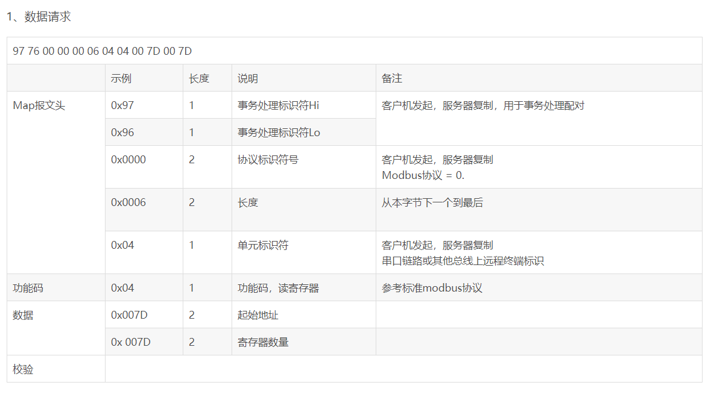
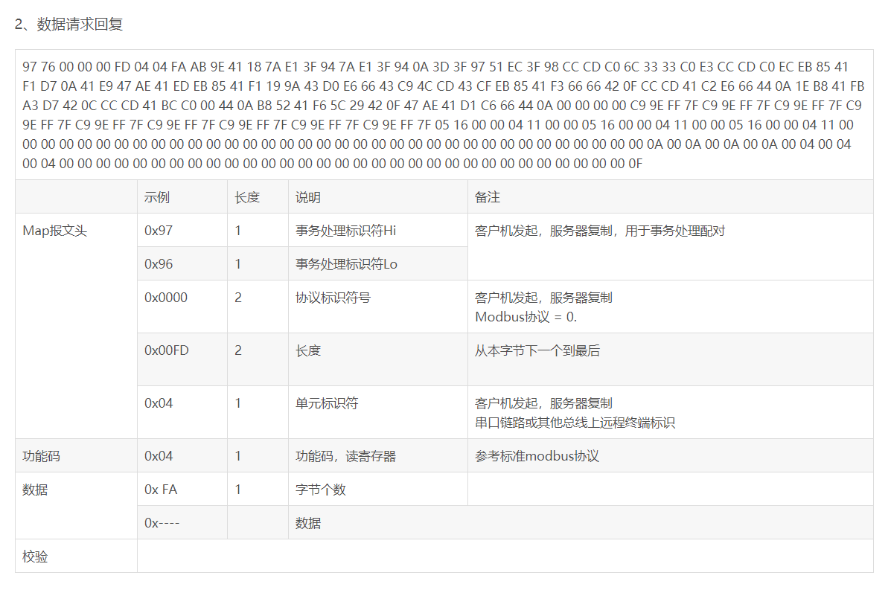
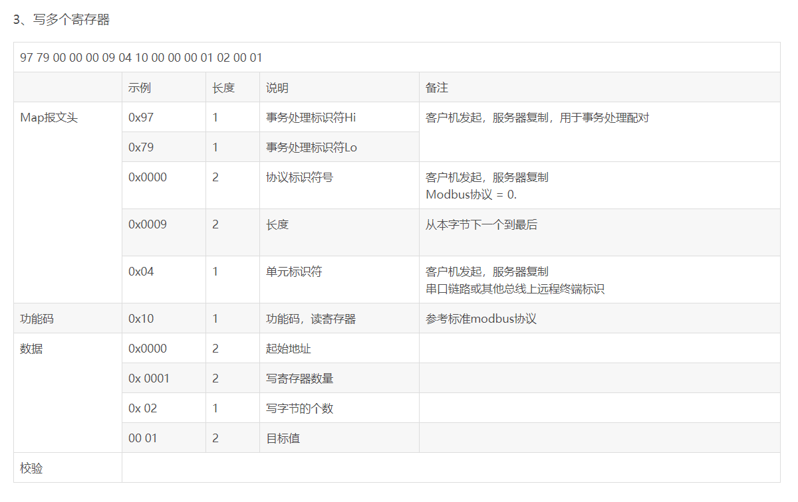
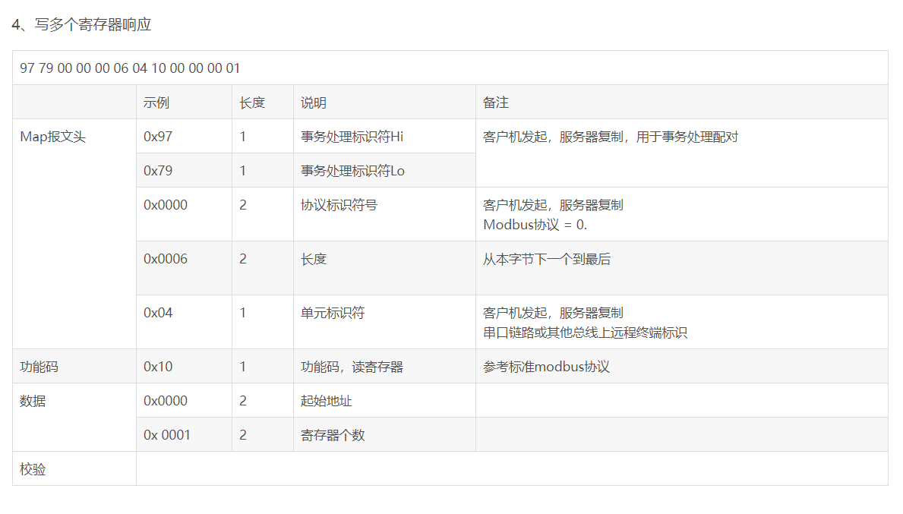

#                                        Modbus TCP

### 一、简介

Modbus由MODICON公司于1979年开发，是一种**工业现场总线**协议标准。1996年**施耐德**公司推出基于**以太网TCP/IP**的Modbus协议：**ModbusTCP**。

Modbus协议是一项应用层报文传输协议，包括ASCII、RTU、**TCP**三种报文类型。

标准的Modbus协议物理层接口有RS232、RS422、RS485和**以太网**接口，采用**master/slave**方式通信。

### 二、数据帧

ModbusTCP的数据帧可分为两部分：**MBAP**+**PDU**。

#### 1、MBAP（报文头）

MBAP为报文头，长度为7字节，组成如下：

| 事务处理标识 | 协议标识 | 长度  | 单元标识符 |
| :----------: | :------: | :---: | :--------: |
|    2字节     |  2字节   | 2字节 |   1字节    |

|       内容       | 解释                                                         |
| :--------------: | :----------------------------------------------------------- |
| **事务处理标识** | 可以理解为报文的序列号，一般每次通信之后就要加1以区别不同的通信数据报文。 |
|  **协议标识符**  | 00 00表示ModbusTCP协议。                                     |
|     **长度**     | 表示接下来的数据长度，单位为字节。                           |
|  **单元标识符**  | 可以理解为设备地址。                                         |

#### 2、PDU（帧结构）

PDU由**功能码+数据**组成。功能码为1字节，数据长度不定，由具体功能决定。

- **功能码**

Modbus的操作对象有四种：线圈、离散输入、保持寄存器、输入寄存器。

|    对象    | 含义                                                |
| :--------: | --------------------------------------------------- |
|    线圈    | PLC的输出位，开关量，在Modbus中可读可写             |
|   离散量   | PLC的输入位，开关量，在Modbus中只读                 |
| 输入寄存器 | PLC中只能从模拟量输入端改变的寄存器，在Modbus中只读 |
| 保持寄存器 | PLC中用于输出模拟量信号的寄存器，在Modbus中可读可写 |

根据对象的不同，Modbus的功能码有：

| 功能码 | 含义             |
| :----: | ---------------- |
|  0x01  | 读线圈           |
|  0x05  | 写单个线圈       |
|  0x0F  | 写多个线圈       |
|  0x02  | 读离散量输入     |
|  0x04  | 读输入寄存器     |
|  0x03  | 读保持寄存器     |
|  0x06  | 写单个保持寄存器 |
|  0x10  | 写多个保持寄存器 |

说明更详细的表：

| 代码 | 中文名称         | 英文名                  | 位操作/字操作 | 操作数量   |
| ---- | ---------------- | ----------------------- | ------------- | ---------- |
| 01   | 读线圈状态       | READ COIL STATUS        | 位操作        | 单个或多个 |
| 02   | 读离散输入状态   | READ INPUT STATUS       | 位操作        | 单个或多个 |
| 03   | 读保持寄存器     | READ HOLDING REGISTER   | 字操作        | 单个或多个 |
| 04   | 读输入寄存器     | READ INPUT REGISTER     | 字操作        | 单个或多个 |
| 05   | 写线圈状态       | WRITE SINGLE COIL       | 位操作        | 单个       |
| 06   | 写单个保持寄存器 | WRITE SINGLE REGISTER   | 字操作        | 单个       |
| 15   | 写多个线圈       | WRITE MULTIPLE COIL     | 位操作        | 多个       |
| 16   | 写多个保持寄存器 | WRITE MULTIPLE REGISTER | 字操作        | 多个       |

### 三、实例

**0x01：读线圈**

在从站中读1~2000个连续线圈状态，ON=1,OFF=0

- 请求：MBAP 功能码 起始地址H 起始地址L 数量H 数量L（共12字节）
- 响应：MBAP 功能码 数据长度 数据（一个地址的数据为1位）
- 如：在从站0x01中，读取开始地址为0x0002的线圈数据，读0x0008位
  00 01 00 00 00 06 01 01 00 02 00 08
- 回：数据长度为0x01个字节，数据为0x01，第一个线圈为ON，其余为OFF
  00 01 00 00 00 04 01 01 01 01

**0x05：写单个线圈**

将从站中的一个输出写成ON或OFF，0xFF00请求输出为ON,0x000请求输出为OFF

- 请求：MBAP 功能码 输出地址H 输出地址L 输出值H 输出值L（共12字节）
- 响应：MBAP 功能码 输出地址H 输出地址L 输出值H 输出值L（共12字节）
- 如：将地址为0x0003的线圈设为ON
  00 01 00 00 00 06 01 05 00 03 FF 00
- 回：写入成功
  00 01 00 00 00 06 01 05 00 03 FF 00

**0x0F：写多个线圈**

将一个从站中的一个线圈序列的每个线圈都强制为ON或OFF，数据域中置1的位请求相应输出位ON，置0的位请求响应输出为OFF

- 请求：MBAP 功能码 起始地址H 起始地址L 输出数量H 输出数量L 字节长度 输出值H 输出值L
- 响应：MBAP 功能码 起始地址H 起始地址L 输出数量H 输出数量L

**0x02：读离散量输入**

从一个从站中读1~2000个连续的离散量输入状态

- 请求：MBAP 功能码 起始地址H 起始地址L 数量H 数量L（共12字节）
- 响应：MBAP 功能码 数据长度 数据（长度：9+ceil（数量/8））
- 如：从地址0x0000开始读0x0012个离散量输入
  00 01 00 00 00 06 01 02 00 00 00 12
- 回：数据长度为0x03个字节，数据为0x01 04 00，表示第一个离散量输入和第11个离散量输入为ON，其余为OFF
  00 01 00 00 00 06 01 02 03 01 04 00

**0x04：读输入寄存器**

从一个远程设备中读1~2000个连续输入寄存器

- 请求：MBAP 功能码 起始地址H 起始地址L 寄存器数量H 寄存器数量L（共12字节）
- 响应：MBAP 功能码 数据长度 寄存器数据(长度：9+寄存器数量×2)
- 如：读起始地址为0x0002，数量为0x0005的寄存器数据
  00 01 00 00 00 06 01 04 00 02 00 05
- 回：数据长度为0x0A，第一个寄存器的数据为0x0c，其余为0x00
  00 01 00 00 00 0D 01 04 0A 00 0C 00 00 00 00 00 00 00 00

**0x03：读保持寄存器**

从远程设备中读保持寄存器连续块的内容

- 请求：MBAP 功能码 起始地址H 起始地址L 寄存器数量H 寄存器数量L（共12字节）
- 响应：MBAP 功能码 数据长度 寄存器数据(长度：9+寄存器数量×2)
- 如：起始地址是0x0000，寄存器数量是 0x0003
  00 01 00 00 00 06 01 03 00 00 00 03
- 回：数据长度为0x06，第一个寄存器的数据为0x21，其余为0x00
  00 01 00 00 00 09 01 03 06 00 21 00 00 00 00

**0x06：写单个保持寄存器**

在一个远程设备中写一个保持寄存器

- 请求：MBAP 功能码 寄存器地址H 寄存器地址L 寄存器值H 寄存器值L（共12字节）
- 响应：MBAP 功能码 寄存器地址H 寄存器地址L 寄存器值H 寄存器值L（共12字节）
- 如：向地址是0x0000的寄存器写入数据0x000A
  00 01 00 00 00 06 01 06 00 00 00 0A
- 回：写入成功
  00 01 00 00 00 06 01 06 00 00 00 0A

**0x10：写多个保持寄存器**

在一个远程设备中写连续寄存器块（1~123个寄存器）

- 请求：MBAP 功能码 起始地址H 起始地址L 寄存器数量H 寄存器数量L 字节长度 寄存器值（13+寄存器数量×2）
- 响应：MBAP 功能码 起始地址H 起始地址L 寄存器数量H 寄存器数量L（共12字节）
- 如：向起始地址为0x0000，数量为0x0001的寄存器写入数据，数据长度为0x02，数据为0x000F
  00 01 00 00 00 09 01 10 00 00 00 01 02 00 0F
- 回：写入成功
  00 01 00 00 00 06 01 10 00 00 00 01

### 四：示例报文解析

ModBusTcp除了不包括2个字节的CRC校验字段外，与Modbus RTU的数据域是一致的，这里给出几个ModbusTcp的链路解析说明。

### 五、通信方式

Modbus设备可分为主站(poll)和从站(slave)。主站只有一个，从站有多个，主站向各从站发送请求帧，从站给予响应。在使用TCP通信时，主站为client端，主动建立连接；从站为server端，等待连接。

- 主站请求：功能码+数据
- 从站正常响应：请求功能码+响应数据
- 从站异常响应：异常功能码+异常码，其中异常功能码即将请求功能码的最高有效位置1，异常码指示差错类型
- **注意：需要超时管理机制，避免无期限的等待可能不出现的应答**

IANA（Internet Assigned Numbers Authority，互联网编号分配管理机构）给Modbus协议赋予TCP端口号为**502**，这是目前在仪表与自动化行业中唯一分配到的端口号。

**通信过程**

1. connect 建立TCP连接

2. 准备Modbus报文

3. 使用send命令发送报文

4. 在同一连接下等待应答

5. 使用recv命令读取报文，完成一次数据交换

   ...........

6. 通信任务结束时，关闭TCP连接

### 六、仿真软件

- Modbus poll 和Modbus slave是一组Modbus仿真软件，可以实现Modbus RTU、TCP、串口仿真等。
- 仿真软件网址：https://modbustools.com/download.html
- 在ModbusTCP中，Modbus poll 作为客户端请求数据，Modbus slave 作为服务器端处理请求。
- 使用c语言编写客户端连接Modbus slave时，注意数据格式，一条指令一次性发出，否则连接会出错。
- 使用软件时，需要指定功能码，在setup->slave definition或者poll definition中进行设置。
  – slave ID：从站编号（事务标识符）
  – function：功能码，0x01对应线圈操作，0x02对应离散量操作，0x03对应保持寄存器操作，0x04对应输入寄存器操作
  – address：开始地址
  – quantity：寄存器/线圈/离散量 的数量

### 七、一些概念

在工业自动化控制中，经常会遇到开关量，数字量，模拟量，离散量，脉冲量等各种概念，而人们在实际应用中，对于这些概念又很容易混淆。现将各种概念罗列如下：

#### 1.开关量：

一般指的是触点的“开”与“关”的状态，一般在计算机设备中也会用“0”或“1”来表示开关量的状态。开关量分为有源开关量信号和无源开关量信号，有源开关量信号指的是“开”与“关”的状态是带电源的信号，专业叫法为跃阶信号，可以理解为脉冲量，一般的都有220VAC, 110VAC,24VDC,12VDC等信号，无源开关量信号指的是“开”和“关”的状态时不带电源的信号，一般又称之为干接点。电阻测试法为电阻0或无穷大。

#### 2.数字量：

很多人会将数字量与开关量混淆，也将其与模拟量混淆。数字量在时间和数量上都是离散的物理量，其表示的信号则为数字信号。数字量是由0和1组成的信号，经过编码形成有规律的信号，量化后的模拟量就是数字量。

#### 3.模拟量：

模拟量的概念与数字量相对应，但是经过量化之后又可以转化为数字量。模拟量是在时间和数量上都是连续的物理量，其表示的信号则为模拟信号。模拟量在连续的变化过程中任何一个取值都是一个具体有意义的物理量，如温度，电压，电流等。

#### 4.离散量：

离散量是将模拟量离散化之后得到的物理量。即任何仪器设备对于模拟量都不可能有个完全精确的表示，因为他们都有一个采样周期，在该采样周期内，其物理量的数值都是不变的，而实际上的模拟量则是变化的。这样就将模拟量离散化，成为了离散量。

#### 5.脉冲量：

脉冲量就是瞬间电压或电流由某一值跃变到另一值的信号量。在量化后，其变化持续有规律就是数字量，如果其由0变成某一固定值并保持不变，其就是开关量。

> 综上所述，模拟量就是在某个过程中时间和数量连续变化的物理量，由于在实际的应用中，所有的仪器设备对于外界数据的采集都有一个采样周期，其采集的数据只有在下一个采样周期开始时才有变动，采样周期内其数值并不随模拟量的变化而变动。
> 这样就将模拟量离散化了，例如：某设备的采样周期为1秒，其在第五秒的时间采集的温度为35度，而第六秒的温度为36度，该设备就只能标称第五秒时间温度35度，第六秒时间温度36度，而第五点五秒的时间其标称也只是35度，但是其实际的模拟量是35.5度。这样就将模拟信号离散化。其采集的数据就是离散化了，不再是连续的模拟量信号。
> 由于计算机只识别0和1两个信号，即开关量信号，用其来表示数值都是使用数字串来表示，由于计算能力的问题，其数字串不能无限长，即其表达的精度也是有限的，同样的以温度为例，由于数字串限制，其表达温度的精度只能达到0.1度，小于该单位的数值则不能被标称，这样就必须将离散量进行量化，将其变为数字量。即35.68度的温度则表示为35.6度。